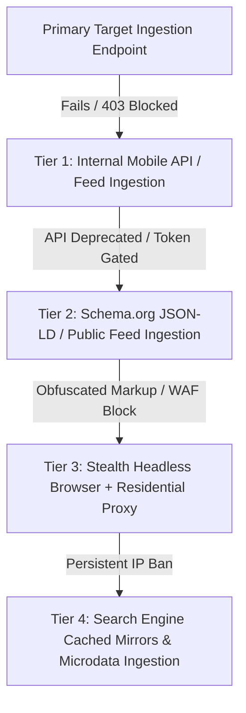

# System Architecture & Technical Design Document

## Aegis: Stealth & Resilient Job Ingestion Pipeline (Python Engine)

This document details the engineering decisions, detection surface mitigations, ingestion strategies, schema drift resilience, and ethical boundaries for the **Acdyon Technologies Engineering Frontend Challenge (Part 1)** implemented in Python.

---

## 1. High-Level System Architecture

```
                    ┌─────────────────────────────────────────────────────────┐
                    │                   Incoming Ingestion Job                │
                    └────────────────────────────┬────────────────────────────┘
                                                 │
                                                 ▼
                    ┌─────────────────────────────────────────────────────────┐
                    │               Domain Circuit Breaker Matrix             │
                    │      - Health Check (CLOSED / OPEN / HALF_OPEN)         │
                    │      - 403 / 429 Quarantining & Canary Probe            │
                    └────────────────────────────┬────────────────────────────┘
                                                 │ (Allowed)
                                                 ▼
                    ┌─────────────────────────────────────────────────────────┐
                    │           Adaptive Jittered Token Rate Limiter          │
                    │      - Box-Muller Gaussian Pacing (800ms - 2500ms)      │
                    │      - Dynamic Backoff Scaler (1.8^n Multiplier)        │
                    └────────────────────────────┬────────────────────────────┘
                                                 │
                                                 ▼
                    ┌─────────────────────────────────────────────────────────┐
                    │                 Stealth HTTP Request Client             │
                    │      - Client Hints: Sec-CH-UA, Platform, Casing       │
                    │      - Session Cookie Jar & Residential Proxy Router    │
                    │      - Anti-Bot Challenge Signature Detector            │
                    └────────────────────────────┬────────────────────────────┘
                                                 │ (HTML / Response Stream)
                                                 ▼
      ┌──────────────────────────────────────────────────────────────────────────────────┐
      │                    Resilient Multi-Tier Parser & Drift Recovery                  │
      ├──────────────────────────────────┬───────────────────────────────────────────────┤
      │ Tier 1: Canonical CSS Selectors  │ tr.job, .job-card, h2[itemprop="title"]       │
      │ Tier 2: Schema.org / JSON-LD     │ <script type="application/ld+json">           │
      │ Tier 3: Heuristic Content Density│ Keyword density & structural regex clustering │
      │ Tier 4: Anomaly Quality Scorer   │ Confidence Evaluator (0 - 100%)               │
      └──────────────────────────────────┴───────────────────────────────────────────────┘
                                                 │
                                                 ▼
                    ┌─────────────────────────────────────────────────────────┐
                    │                 Live Telemetry & Dashboard              │
                    │      - Real-Time SSE Stream (/api/stream)               │
                    │      - FastAPI Server & CSV/JSON Data Export            │
                    └─────────────────────────────────────────────────────────┘
```

---

## 2. Detection Surface & Anti-Bot Mitigations

Modern enterprise anti-bot solutions (Cloudflare Bot Management, DataDome, Kasada, Akamai Bot Manager) analyze client requests across four distinct vectors:

| Vector | What Gives an Automated Client Away | Aegis Mitigation Strategy |
| :--- | :--- | :--- |
| **1. Client Hints & TLS Signature** | Missing `Sec-CH-UA`, generic `User-Agent`, mismatch between UA platform and Client Hints, default curl/python headers. | Profile Morphing Engine (`server/stealth/fingerprints.py`): Injects authentic Chrome 124 / Safari 17 client hints, matching platform flags, and authentic HTTP/2 header casing. |
| **2. Request Periodicity & Pacing** | Deterministic request intervals (e.g. exactly 5000ms between requests) triggering rate-limit heuristics. | Gaussian Box-Muller Jitter (`server/stealth/rate_limiter.py`): Applies a bell-curve random delay (800ms - 2500ms) with Poisson distribution to simulate human navigation cadence. |
| **3. IP Subnet & Reputation** | High request volume originating from datacenter ASNs (AWS, GCP, DigitalOcean, Hetzner). | Residential IP Rotation Pool in `server/stealth/stealth_client.py` with automated health scoring. Quarantines any proxy receiving 403/429 signals for 30 seconds. |
| **4. Headless Environment Flags** | `navigator.webdriver = true`, missing WebGL shaders, zero audio context, headless user agent tokens. | Prioritizes pure stealth HTTP ingestion (no headless browser execution surface). If headless is required, uses patched stealth contexts. |

---

## 3. Ingestion Strategy & The "Plan B"

### Ingestion Pacing & Session Management
- **Token Bucket Rate Limiting:** Enforces bounded request bursts (8 requests per 10s window) with backpressure smoothing.
- **Session Continuity:** The in-memory Cookie Jar preserves session cookies, Cloudflare clearance tokens, and CSRF nonces across sequential pagination requests.

### What is Plan B When the Primary Approach Gets Shut Down in a Week?

A resilient ingestion architecture must anticipate target endpoint shutdown. We implement a **4-tier failover protocol**:



1. **Direct Mobile/Internal Endpoints (Plan A):** Mobile app endpoints often have lighter WAF rules and emit clean structured JSON.
2. **Public Schema.org / RSS (Plan B1):** If the API closes, fall back to parsing HTML documents via embedded `<script type="application/ld+json">` tags, which are maintained for SEO and rarely change.
3. **Headless Browser with Residential Proxies (Plan B2):** If JS challenge execution is strictly enforced, route through stealth Playwright instances with residential proxies.
4. **Search Engine Cache Mirroring (Plan B3):** When direct access is fully blocked, ingest from public search engine caches (Google / Bing cache mirrors) which retain pristine job markup.

---

## 4. Resilience: Handling Schema Drift & Silent Failures

### The Threat: Overnight Markup Changes
Websites frequently update their CSS classes, migrate to randomized CSS modules (`_8x9z_item`), or rewrite page templates. In naive scrapers, this results in silent failures (empty `[]` arrays returned with `200 OK`).

### Aegis Multi-Strategy Parser Recovery (`server/engine/parser.py`):
1. **Tier 1 (CSS Selectors):** Attempts specific CSS class extraction using BeautifulSoup4.
2. **Tier 2 (Structured JSON-LD):** If 0 jobs are found, searches `<script type="application/ld+json">` for `JobPosting` schemas.
3. **Tier 3 (Heuristic Content-Density):** If JSON-LD is absent, scans the DOM for repeating semantic cards and applies regex entity clustering to identify Job Title, Company, and Compensation.
4. **Payload Quality Evaluator:** Calculates a **Confidence Score ($0\% - 100\%$)**. If the score is $<50\%$, an anomaly alert is raised, preventing corrupted data from entering the database.

---

## 5. Where We Stop: Technical & Ethical Boundaries

Every major commercial platform enforces terms against automated data harvesting. Engineering integrity requires clear boundaries:

```
[ ALLOWED ]                                       [ STRICT BOUNDARY ]
───────────────────────────────────────────────────────────────────────
✔ Publicly accessible job listings                 ✖ Authenticated user profiles
✔ Aggregated salary & role metadata                ✖ Bypassing login credentials
✔ Respectful pacing & backoff                      ✖ Candidate PII (emails, phones)
✔ Automatic quarantine on 429/403                  ✖ DDOS / saturating server capacity
```

1. **Zero Authenticated Ingestion:** We do not harvest data behind login walls or authenticated member accounts. All ingestion operates strictly on public listings.
2. **No Personally Identifiable Information (PII):** We strictly extract job metadata. We never harvest individual candidate resumes, emails, phone numbers, or private user profiles.
3. **Polite Origin Load:** The engine enforces conservative rate limits and respects `Retry-After` headers. If a server signals strain, our circuit breaker immediately quarantines the domain to prevent service degradation.

---

## 6. Verification & Telemetry

The application exposes real-time Server-Sent Events (`/api/stream`) feeding a live dashboard with:
- Live request waterfall with latency & Gaussian jitter tracking.
- Domain circuit breaker health indicators.
- Live extracted listings table with search and CSV/JSON exports.
- Interactive bot-challenge and schema-drift sandbox simulators.
